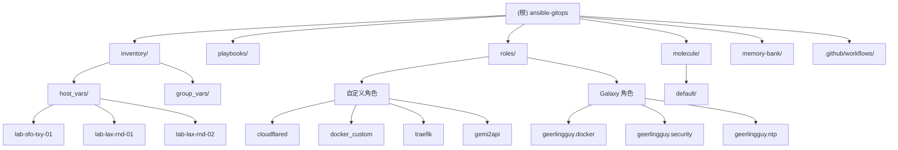

# Ansible GitOps for VPS & Homelab - AI 上下文文档

## 变更记录 (Changelog)

### 2025-12-01 10:13:17
- **初始化**: 通过自适应架构师工具生成完整的 AI 上下文文档
- **覆盖范围**: 扫描了项目的核心结构、4个自定义角色、3个主机配置、完整的 Molecule 测试套件
- **模块识别**: 识别出 4 个自定义角色模块和 4 个 Galaxy 角色依赖

---

## 项目愿景

Ansible GitOps 是一个基于"Configuration over Creation"理念的 VPS/Homelab 基础设施即代码项目。项目优先复用成熟的 Ansible Galaxy 角色（geerlingguy 系列），仅针对 Cloudflare Tunnel、共享 Docker 网络、Traefik 反向代理和 API 服务等特定场景编写少量胶水代码。

**核心目标**：
- 声明式管理多台 Debian 13 (Trixie) VPS 主机
- 零信任网络接入（Cloudflare Tunnel）
- 容器化业务部署（Docker + Traefik）
- 可观测性监控栈（Prometheus + Alertmanager + Grafana）
- GitOps 全流程自动化（GitHub Actions + Molecule CI）

---

## 架构总览

### 技术栈

| 层级 | 技术 | 用途 |
|------|------|------|
| **IaC 引擎** | Ansible 11.12.0 | 配置管理与编排 |
| **测试框架** | Molecule 25.11.1 + Docker | 角色回归测试 |
| **容器平台** | Docker CE + Docker Compose | 应用容器化 |
| **网络接入** | Cloudflare Tunnel | 零信任隧道（无需开放入站端口） |
| **反向代理** | Traefik v3 | HTTPS 自动化 + 动态路由 |
| **监控栈** | Prometheus + Alertmanager + Grafana | 指标采集、告警、可视化 |
| **质量工具** | ansible-lint + yamllint | 代码规范检查 |

### 设计原则

1. **Configuration over Creation**: 优先使用 Galaxy 社区角色，版本锁定在 `requirements.yml`
2. **最小暴露**: 默认仅开放 SSH 端口（通过 `geerlingguy.firewall` 控制），业务流量通过 Cloudflare Tunnel
3. **幂等性**: 所有任务支持重复执行，使用 Ansible 原生模块而非 `shell/command`
4. **密钥分离**: 敏感数据通过 Ansible Vault 加密，存储在 `inventory/**/secrets.yml`
5. **CI/CD Ready**: GitHub Actions 自动运行 Molecule 测试 + 生产部署

---

## 模块结构图



---

## 模块索引

| 模块路径 | 类型 | 职责 | 状态 |
|----------|------|------|------|
| `roles/cloudflared` | 自定义 | 部署 Cloudflare Tunnel 容器，渲染配置与凭据文件 | ✅ 生产 |
| `roles/docker_custom` | 自定义 | 创建 `proxy_net` 共享桥接网络（10.203.57.0/24） | ✅ 生产 |
| `roles/traefik` | 自定义 | 部署 Traefik v3 反向代理，支持 ACME DNS-01 自动证书 | ✅ 生产 |
| `roles/gemi2api` | 自定义 | 部署 Gemini to OpenAI API 转换服务 | ✅ 生产 |
| `geerlingguy.docker` | Galaxy | 安装 Docker Engine + Compose 插件 | ✅ v7.8.0 |
| `geerlingguy.security` | Galaxy | SSH 加固、Fail2ban、自动安全更新 | ✅ v3.0.0 |
| `geerlingguy.ntp` | Galaxy | 时间同步（chrony/ntp） | ✅ v3.0.0 |
| `prometheus.prometheus.*` | Galaxy Collection | Prometheus + Alertmanager + Node Exporter | ✅ v0.27.4 |
| `grafana.grafana.grafana` | Galaxy Collection | Grafana Server 及数据源配置 | ✅ v6.0.6 |

---

## 运行与开发

### 前置依赖

- **本地开发**:
  - Python 3.13+
  - `python3-venv`
  - SSH 密钥（默认 `~/.ssh/id_ed25519`，可通过 `ANSIBLE_SSH_KEY_PATH` 覆盖）
  - Vault 密码文件（存放在项目根目录 `.vault-password`）

### 初始化环境

```bash
# 1. 克隆仓库
git clone https://github.com/bernylinville/ansible-gitops.git
cd ansible-gitops

# 2. 创建虚拟环境
python3 -m venv .venv
source .venv/bin/activate

# 3. 安装 Python 依赖
pip install --upgrade pip
pip install -r requirements.txt

# 4. 安装 Ansible 角色与集合
ansible-galaxy install -r requirements.yml
ansible-galaxy collection install -r collections/requirements.yml

# 5. 配置 Vault 密码（获取密码后写入 .vault-password）
echo "YOUR_VAULT_PASSWORD" > .vault-password
chmod 600 .vault-password
```

### 常用命令

```bash
# 代码质量检查
ansible-lint
yamllint .

# Dry Run（检查变更）
ansible-playbook -i inventory/hosts.yml playbooks/site.yml --check --diff

# 执行完整部署
ansible-playbook -i inventory/hosts.yml playbooks/site.yml

# 部分执行（使用 tags）
ansible-playbook -i inventory/hosts.yml playbooks/site.yml --tags facts,deps,cloudflared

# Molecule 测试（回归测试自定义角色）
molecule test

# Molecule 调试（保留容器）
molecule converge
molecule verify
molecule login
molecule destroy
```

### 目录结构说明

```
ansible-gitops/
├── .github/workflows/        # GitHub Actions CI/CD 工作流
│   └── gitops.yml           # Molecule 测试 + 生产部署
├── inventory/               # 主机清单与变量
│   ├── hosts.yml           # 主机定义（3台 VPS）
│   ├── group_vars/
│   │   ├── all.yml         # 全局变量（Python 解释器、域名等）
│   │   └── vps/
│   │       ├── main.yml    # VPS 组共享配置（Docker、防火墙、NTP 等）
│   │       └── secrets.yml # 加密的组级密钥（Vault）
│   └── host_vars/          # 各主机专属配置
│       ├── lab-sfo-txy-01/ # 监控主机（启用 Prometheus/Grafana）
│       ├── lab-lax-rnd-01/ # 标准 VPS
│       └── lab-lax-rnd-02/ # 标准 VPS
├── playbooks/
│   └── site.yml            # 主编排入口
├── roles/
│   ├── cloudflared/        # 自定义：Cloudflare Tunnel
│   ├── docker_custom/  # 自定义：共享 Docker 网络
│   ├── traefik/            # 自定义：Traefik 反向代理
│   ├── gemi2api/           # 自定义：Gemini API 服务
│   └── geerlingguy.*/      # Galaxy 安装的社区角色（gitignore）
├── molecule/
│   └── default/            # Molecule 测试场景（Debian 13 容器）
│       ├── molecule.yml    # 场景配置
│       ├── converge.yml    # 测试 Playbook
│       └── verify.yml      # 断言测试
├── memory-bank/            # 架构决策与 PRD 文档
├── ansible.cfg             # Ansible 配置（roles_path、vault_password_file）
├── requirements.yml        # Galaxy 角色版本锁
├── collections/requirements.yml  # Galaxy 集合版本锁
└── requirements.txt        # Python 依赖
```

---

## 测试策略

### Molecule 回归测试

项目使用 Molecule + Docker 在容器中模拟完整的部署流程：

- **镜像**: `bernylinville/docker-debian13-ansible:latest` (特权容器，支持 systemd)
- **测试主机**: `debian13` (加入 `vps` 组)
- **测试场景**: `molecule/default/`
  - `converge.yml`: 执行 `playbooks/site.yml` 的完整部署
  - `verify.yml`: 验证关键服务状态（Fail2ban、Docker、Node Exporter、proxy_net 网络）

### 验证项

```yaml
✅ Fail2ban 服务运行中
✅ Docker 与 Docker Compose 已安装
✅ Node Exporter 服务运行并监听 9100 端口
✅ 共享 Docker 网络 proxy_net 存在
✅ （可选）Cloudflared 容器运行并加入 proxy_net
✅ （可选）Prometheus/Alertmanager/Grafana 服务运行
```

### CI 集成

GitHub Actions 工作流（`.github/workflows/gitops.yml`）在以下情况触发：

1. **Push to main**: 自动运行 Molecule 测试 + 生产部署
2. **Pull Request**: 仅运行 Molecule 测试

**工作流步骤**：
```yaml
1. 安装 Python 依赖 (requirements.txt)
2. 安装 Ansible 角色与集合
3. 注入 Vault 密码与 SSH 密钥
4. 执行 molecule test (测试 Job)
5. 执行 ansible-playbook playbooks/site.yml (部署 Job)
```

---

## 编码规范

### Ansible 风格

1. **YAML 格式**:
   - 使用 2 空格缩进
   - 键值对使用 `key: value` 格式（冒号后空格）
   - 列表项使用 `- item` 格式

2. **命名约定**:
   - 角色变量使用 `<role_name>_<variable_name>` 前缀（如 `cloudflared_image_tag`）
   - 布尔变量使用 `_enabled` 或 `_enable` 后缀
   - 文件路径变量使用 `_path` 后缀

3. **任务规范**:
   - 每个任务必须有 `name` 描述
   - 优先使用 Ansible 模块（避免 `shell`/`command`）
   - 敏感数据使用 `no_log: true`
   - 变更操作使用 `register` 捕获结果

4. **幂等性要求**:
   - 所有任务支持重复执行
   - 使用 `when` 条件避免不必要的变更
   - 容器部署使用 `recreate` 参数响应配置变更

### 质量检查

```bash
# ansible-lint（排除 Galaxy 角色）
ansible-lint  # 配置在 .ansible-lint

# yamllint（自动忽略 .venv 和第三方角色）
yamllint .
```

**常见规则**：
- 禁止使用 `latest` 标签（除非显式声明）
- 敏感变量必须通过 Vault 加密
- 角色必须定义 `defaults/main.yml`

---

## AI 使用指引

### 项目上下文路径

- **根文档**: `/home/kchou/Code/ansible-gitops/CLAUDE.md` (当前文件)
- **模块文档**:
  - [cloudflared](./roles/cloudflared/CLAUDE.md)
  - [docker_custom](./roles/docker_custom/CLAUDE.md)
  - [traefik](./roles/traefik/CLAUDE.md)
  - [gemi2api](./roles/gemi2api/CLAUDE.md)
- **架构决策**: `memory-bank/architecture.md`
- **产品需求**: `memory-bank/product-requirements-document.md`

### 变更流程建议

1. **阅读相关模块的 `CLAUDE.md`** 了解现有实现
2. **检查 `memory-bank/` 文档** 确认是否符合架构原则
3. **本地测试**:
   ```bash
   molecule converge  # 快速验证
   molecule verify    # 运行断言
   ```
4. **提交变更**:
   - 使用 Conventional Commits（如 `feat:`, `fix:`, `refactor:`）
   - 在 PR 中附上 `--check --diff` 输出摘要

### 常见任务模板

#### 添加新主机

1. 在 `inventory/hosts.yml` 添加主机条目
2. 创建 `inventory/host_vars/<hostname>/main.yml` 和 `secrets.yml`
3. 加密 secrets: `ansible-vault encrypt inventory/host_vars/<hostname>/secrets.yml`

#### 添加新容器服务

1. （可选）创建新角色: `roles/<service_name>/`
2. 在角色 `defaults/main.yml` 定义变量
3. 在 `tasks/main.yml` 使用 `community.docker.docker_container`
4. 更新 `playbooks/site.yml` 引入角色
5. 在 Molecule 场景中测试

#### 修改监控配置

编辑 `inventory/host_vars/lab-sfo-txy-01/main.yml`:
```yaml
prometheus_scrape_configs:  # 添加新的抓取任务
  - job_name: "my_exporter"
    static_configs:
      - targets: ["localhost:9999"]
```

### 敏感信息管理

**加密文件**:
```bash
ansible-vault encrypt inventory/group_vars/vps/secrets.yml
ansible-vault encrypt inventory/host_vars/lab-sfo-txy-01/secrets.yml
```

**编辑加密文件**:
```bash
ansible-vault edit inventory/group_vars/vps/secrets.yml
```

**查看加密文件**:
```bash
ansible-vault view inventory/group_vars/vps/secrets.yml
```

**更换 Vault 密码**:
```bash
ansible-vault rekey inventory/group_vars/vps/secrets.yml
```

---

## 关键配置文件

### ansible.cfg
- `roles_path`: 指向 `roles/` 目录
- `vault_password_file`: 默认读取 `.vault-password`
- `become_password_file`: 默认读取 `.sudo-password`

### inventory/hosts.yml
定义 3 台 VPS 主机及其 Tailscale IP:
- `lab-sfo-txy-01`: 腾讯云硅谷（监控主机）
- `lab-lax-rnd-01`: RackNerd Los Angeles DC03
- `lab-lax-rnd-02`: RackNerd Los Angeles DC03

### playbooks/site.yml
主编排 Playbook，角色执行顺序:
1. `geerlingguy.ntp` - 时间同步
2. `geerlingguy.security` - SSH 加固 + Fail2ban
3. `geerlingguy.docker` - Docker 安装
4. `docker_custom` - 创建 proxy_net
5. `traefik` - 反向代理（条件性）
6. `gemi2api` - API 服务（条件性）
7. `prometheus.prometheus.node_exporter` - 节点监控
8. （条件性）Prometheus/Alertmanager/Grafana
9. （条件性）Cloudflared Tunnel

---

## IMPORTANT:

- Always read memory-bank/architecture.md before writing any code. Include entire database schema.
- Always read memory-bank/product-requirements-document.md before writing any code.
- After adding a major feature or completing a milestone, update memory-bank/architecture.md.

---

## 已知问题与限制

1. **防火墙角色暂时禁用**: `geerlingguy.firewall` 在 `requirements.yml` 和 `playbooks/site.yml` 中被注释，因 UFW 与 Docker 存在兼容性问题（需配置 `firewall_forward_policy: ACCEPT`）

2. **Cloudflared 默认禁用**: 在生产主机需显式设置 `cloudflared_enabled: true` 并配置 `cloudflared_ingress_rules`

3. **监控栈仅在 lab-sfo-txy-01 启用**: 其他主机仅运行 Node Exporter

4. **Vault 密码必须手动管理**: CI 中的 Vault 密码通过 GitHub Secrets 注入，本地开发需手动创建 `.vault-password` 文件

---

## 贡献指南

1. Fork 仓库并创建特性分支（`git checkout -b feature/my-feature`）
2. 阅读 `memory-bank/` 中的架构文档
3. 保持任务幂等性，优先使用 Ansible 模块
4. 所有变更需通过 `ansible-lint`、`yamllint` 和 `molecule test`
5. 使用 Conventional Commits 格式
6. 在 PR 中附上 `--check --diff` 输出摘要

---

## 参考资源

- [Ansible 官方文档](https://docs.ansible.com/)
- [Molecule 测试指南](https://molecule.readthedocs.io/)
- [Jeff Geerling 的 Ansible 角色](https://www.jeffgeerling.com/projects/ansible-roles)
- [Cloudflare Tunnel 文档](https://developers.cloudflare.com/cloudflare-one/connections/connect-networks/)
- [Traefik v3 文档](https://doc.traefik.io/traefik/)
- [Prometheus 官方文档](https://prometheus.io/docs/)
