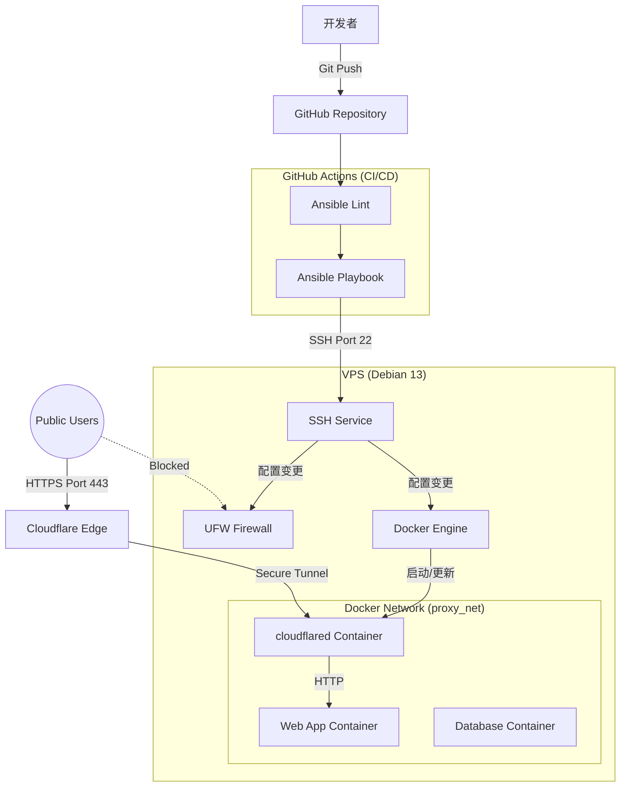

# 技术栈文档 (Tech Stack Document)

## 1. 设计理念

- **K.I.S.S (Keep It Simple, Stupid)**: 拒绝过度设计（如 K8s），使用单机 Docker + Compose 编排。
- **Don't Reinvent the Wheel**: 核心系统层完全依赖社区验证过的 Ansible Roles。
- **GitOps First**: 所有变更必须通过 Git 提交触发，禁止 SSH 手动变更。

## 2. 核心技术栈概览

| 模块               | 技术/工具              | 版本/策略                 | 核心理由                                          |
| :----------------- | :--------------------- | :------------------------ | :------------------------------------------------ |
| **操作系统**       | **Debian 13 (Trixie)** | Stable                    | 目标系统，轻量且稳定。                            |
| **配置管理**       | **Ansible**            | Core 2.20+                | 无 Agent，不仅部署应用，更能管理 OS 配置。        |
| **流水线 (CI/CD)** | **GitHub Actions**     | `ubuntu-latest`           | 免费，与代码库无缝集成，原生 GitOps 引擎。        |
| **容器运行时**     | **Docker CE**          | Latest (Official Repo)    | 工业标准，结合 `geerlingguy.docker` 管理。        |
| **内网穿透/网关**  | **Cloudflare Tunnel**  | Container (`cloudflared`) | 零信任架构，无需公网 IP，无需开放端口。           |
| **机密管理**       | **Ansible Vault**      | AES256                    | 简单有效，文件加密进 Git，密码存 GitHub Secrets。 |
| **代码质量**       | **Ansible Lint**       | Latest                    | 强制规范，防止低级语法错误。                      |

## 3. 详细选型说明

### 3.1 控制平面 (Control Plane)

- **GitHub Actions**: 作为唯一的“控制节点”。
  - **Runner**: 使用 GitHub 托管的 `ubuntu-latest`。
  - **SSH Client**: Runner 通过 SSH Private Key 连接 VPS。
  - **Ansible Strategy**: `mitogen` (可选，用于加速) 或默认 SSH 管道。鉴于机器少，默认即可。

### 3.2 配置管理层 (Ansible)

- **Ansible Core**: 建议版本 **>= 2.20**。
  - _理由_: Debian 13 的 Python 版本较新 (Python 3.13+)，旧版 Ansible 可能存在兼容性警告。
- **Python Environment**:
  - 由于 Debian 13 强制执行 PEP 668 (Externally Managed Environments)，**禁止**直接使用 `pip install` 安装全局包。
  - **策略**: 尽量使用 `apt` 安装系统级 Python 依赖（如 `python3-docker`），或者依赖 `geerlingguy.docker` 自动处理 venv/依赖。

### 3.3 依赖库 (Galaxy Roles)

严格遵循 PRD 的“不重复造轮子”策略：

1.  **`geerlingguy.docker`**:
    - 负责：安装 Docker Engine, Docker Compose Plugin, 配置 Docker Daemon。
    - 配置重点：启用 `json-file` 日志轮转，防止磁盘爆满。
2.  **`geerlingguy.security`**:
    - 负责：SSHD 配置（禁密码、禁 Root）、配置自动安全更新 (`unattended-upgrades`)。
3.  **`geerlingguy.firewall`**:
    - 负责：管理 `ufw`。
    - 策略：默认 `incoming: deny`，`outgoing: allow`，仅放行 SSH 端口。

### 3.4 网络与应用层 (Networking & Runtime)

- **Cloudflare Tunnel (`cloudflared`)**:
  - **部署方式**: 纯 Docker 容器化部署。
  - **网络模式**: 加入自定义 Docker Bridge 网络 (`proxy_net`)。
  - **高可用**: 配置容器 `restart: unless-stopped`。
- **Docker Compose (v2)**:
  - 通过 Ansible 的 `community.docker.docker_compose_v2` 模块进行编排（比旧版 `docker_compose` 模块更兼容新版 Docker）。

## 4. 开发与调试工具 (Local Dev)

为了保证“健壮性”，建议在本地配置以下工具，避免直接在生产环境试错：

- **Visual Studio Code**: 配合 **Ansible 插件** (Red Hat 出品)。
- **Pre-commit**: 本地 Git Hook，提交前自动运行 `ansible-lint`。
- **Vagrant** (可选):
  - 配合 VirtualBox/KVM，在本地生成一个 Debian 13 虚拟机。
  - _用途_: 在推送到 GitHub 前，先在本地 Vagrant 虚拟机上运行 Playbook 验证逻辑。

## 5. 关键版本锁定 (Dependency Pinning)

为了防止未来因为依赖升级导致系统挂掉，必须在 `requirements.yml` 和 `docker images` 中锁定版本：

- **Ansible Roles**: 必须指定 `version: x.y.z`。
- **Docker Images**: 生产环境尽量避免使用 `latest` 标签，建议锁定具体 tag (如 `cloudflare/cloudflared:2024.11.0`)。

## 6. 架构图示

